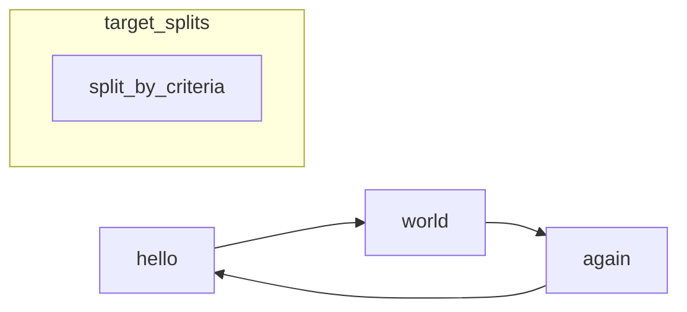
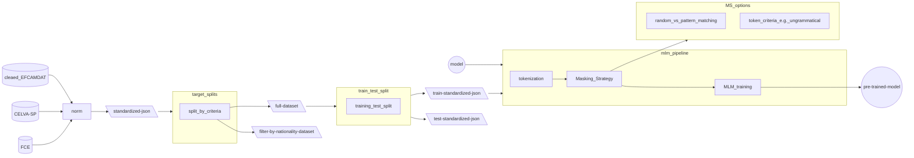

# learner corpora processing pipeline
here we describe a sequence of steps of processing learner corpora for training LLMs
Technically most of the steps can be changed of order
## Automatic download of raw datasets
If you have a gdrive link to the raw file you can setup a .env file and automatically download it

## converting raw file to standardized compressed json 
There are two aspects of compressing:
    - removing useless characters (such as pretty print) it will still as a json
    - transforming to a compressed format such as gzip (but later we will need to descompress)

# mermaid

